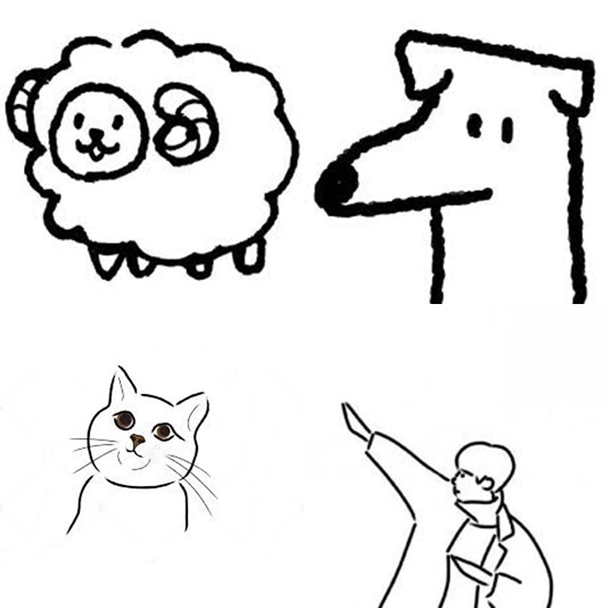
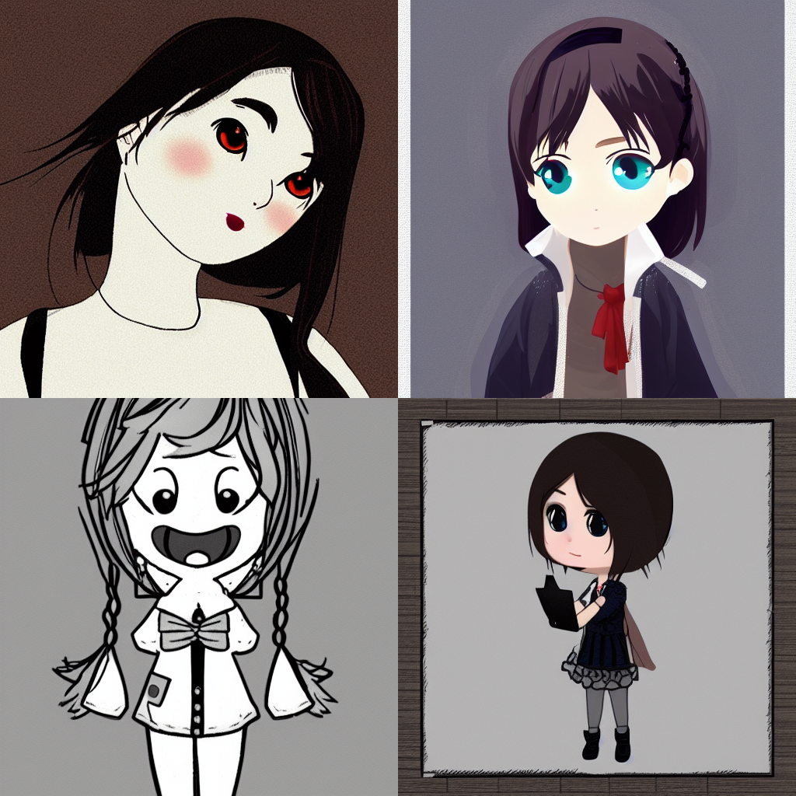
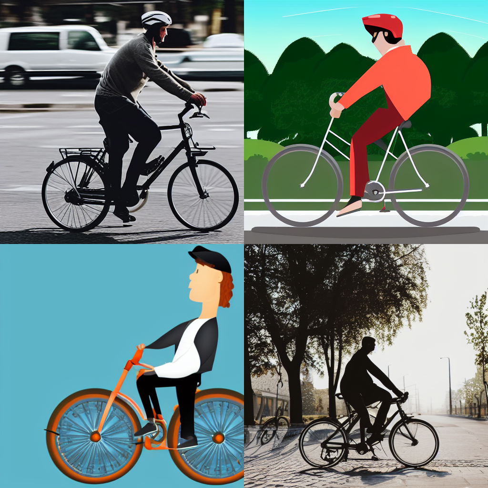
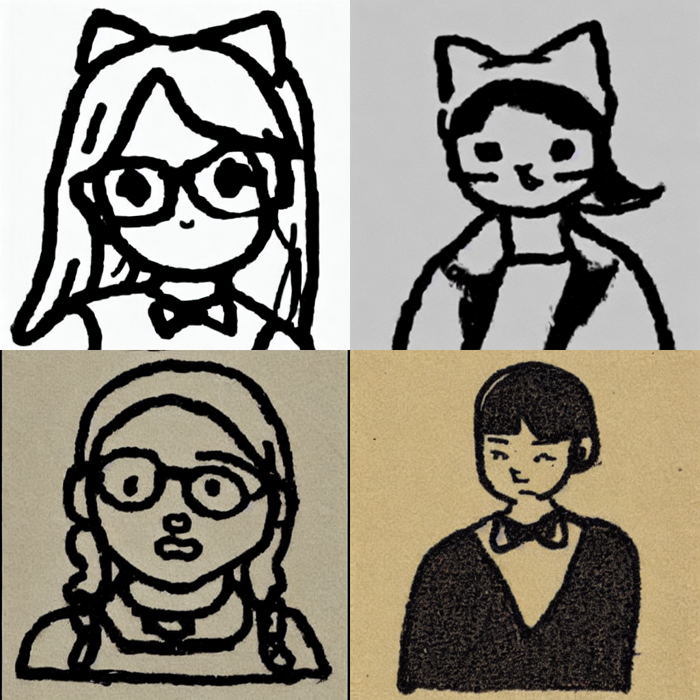
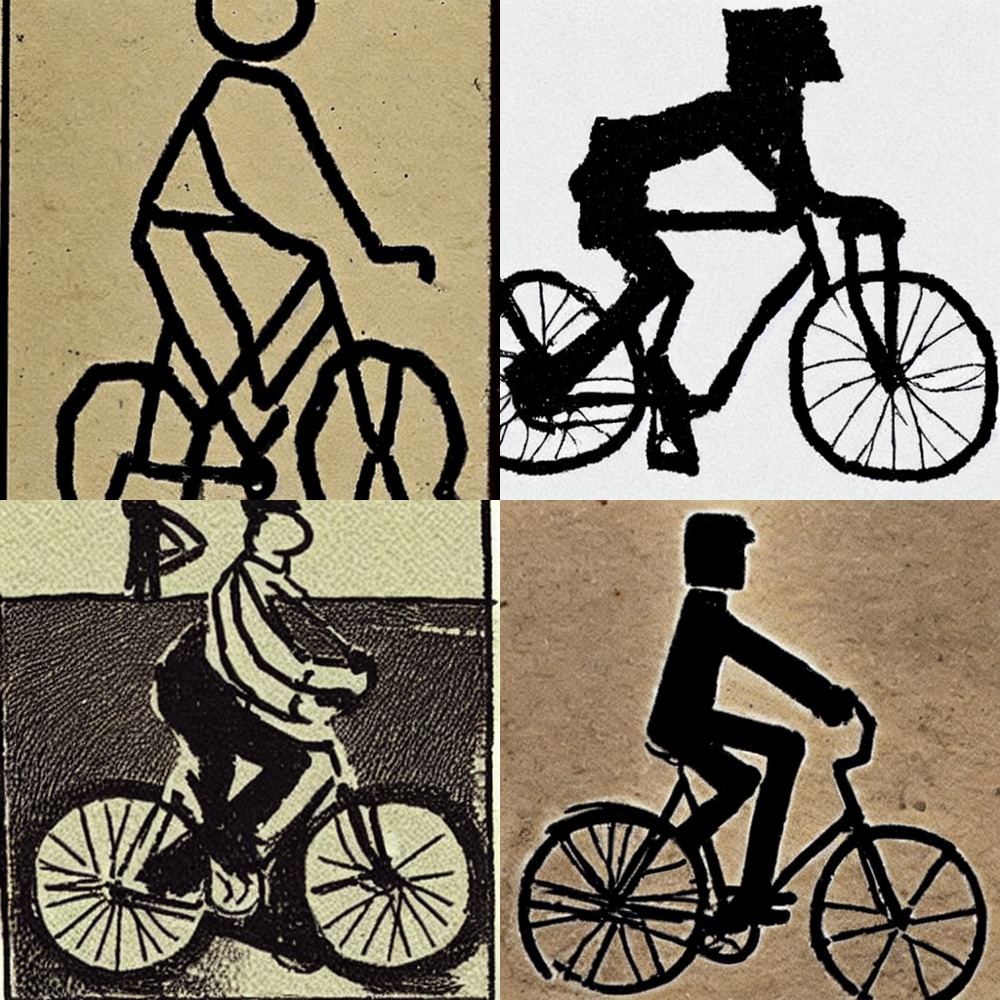

# Stable diffusion style learning

I want to let stable diffusion to learn a new style.

## Data
13 images -> 26 images after horizontal flipping

## Before fine-tuning
using the prompt: "A girl in the style of jbh_0"

using the prompt: "A man riding a bike in the style of jbh_0"

## After fine_tuning
using the prompt: "A girl in the style of jbh_0"

using the prompt: "A man riding a bike in the style of jbh_0"

## model & parameters
- model: runwayml/stable-diffusion-v1-5 (huggingface)
- lr = 1e-6
- total step: 26 * 100 (each image trains for 100 times)

## Conclusion
The stable diffusion learning the new style (I named it as jbh_0) of rough draft through the fine-tuning.